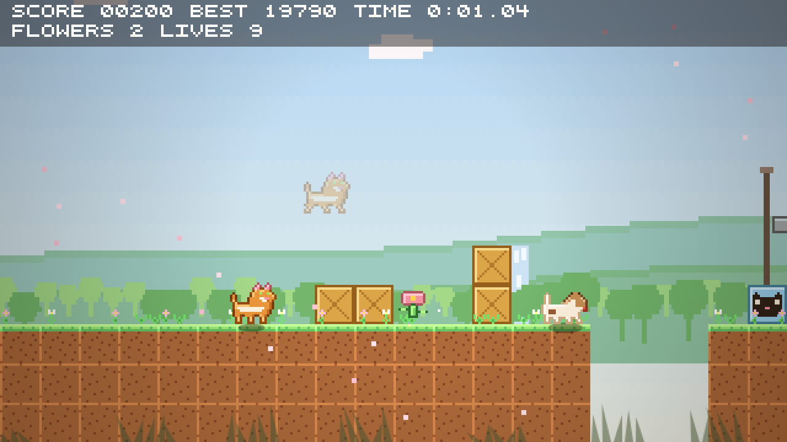

# Quest of the Cat

[Play the game](https://nikked.github.io/questofthecat/) ·
[GitHub Actions](https://github.com/nikked/questofthecat/actions/workflows/deploy.yml)



A small arcade platformer: one run through five seasonal bands — spring, summer,
autumn, a winter summit, and a spring thaw that ends at the sea, by way of a
crate-smashing moveset and a big dog on the shore.

Vanilla TypeScript on Canvas 2D. No runtime dependencies: every game sprite and
sound is generated in code. The cat-face favicon is an SVG asset.

## Run locally

Use Node.js 24 and pnpm 11, matching CI.

```sh
pnpm install
pnpm dev        # http://localhost:5173
```

## Playing

**Play it on a pad.** A DualSense is the intended controller; the keyboard is
the fallback. The title screen offers Start Game, Leaderboard and How to Play.
Choose with arrows or the D-pad and confirm with Enter or Cross. Mouse clicks work too.
Press Options (or Esc) for the full controls, restart, or return to the main menu.
The game fits the browser window at 16:9 and resizes automatically, with dark
purple bars filling any remaining space.

Reaching the sea prompts for your name and sends the run to a shared
leaderboard, which the main menu shows under Leaderboard. Your own best and the
ghost you race stay in this browser.

| | PS5 | Keyboard |
|---|---|---|
| Move | Left stick / D-pad | Arrows / WASD |
| Run | R2 / Circle | Shift |
| Jump | Cross — hold longer to jump higher | Space |
| Spin | Square — a tail whip that reaches past the cat | X or K |
| Slide | L1, R1 or L2, while running | Down, while running |
| Body slam | L1, R1 or L2, in mid-air | Down, in mid-air |
| Pause | Options — resume or restart | Esc |
| Restart | | R, without pausing first |

In mid-air, **hold toward a wall to cling to it, then press jump to kick off**.
Chain kicks to climb the winter chimney before the snow fills it. You need a
fresh press for each kick — holding jump gives you one and nothing after.

A spin can be cancelled into a jump, so it is never a commitment. A slide needs
momentum to start and ends itself, except under a roof too low to stand up in.

Each season flies a **checkpoint flag**. Break the crate at its foot and the
flag runs up the pole green — that is where the cat comes back to, and winter's
is the one worth going out of your way for. Entry and checkpoint areas keep
enemies at least two tiles away.

Final score decides the ending: under 16,000 stays on shore, 16,000 earns a raft,
26,000 a sailboat, and 36,000 a garlanded ship. Crates break but give no points
or flowers, and do not affect the ending. Nitro detonates on
contact. Score comes from stomps and what you pick up, plus a bonus that shrinks
the longer you take. Every hundredth flower buys a life back, and running out
of lives restarts the level rather than ending the run.

Finishing also earns **2,500 points per remaining life**.

The speed bonus is interpolated between these finish times and rounded to whole
points. Runs of 30 seconds or less earn 30,000. After 90 seconds, the bonus
tapers from 500 to zero at 95 seconds.

| Finish time | Speed bonus |
|---|---:|
| 90 seconds | 500 |
| 80 seconds | 1,500 |
| 70 seconds | 2,500 |
| 60 seconds | 5,000 |
| 50 seconds | 10,000 |
| 40 seconds | 20,000 |
| 30 seconds | 30,000 |

The shore is guarded. The flag does not work until the big dog is down. It
charges at wherever you are standing, so jump the charge and let it bury itself
in one of the arena posts — the two seconds it spends stunned are the only
window a spin lands in. Three hits. It is harmless while it reels from one, but
lethal again the moment it recovers, so back off between them.

[Deployment](docs/deployment.md) · [Development](docs/development.md)
